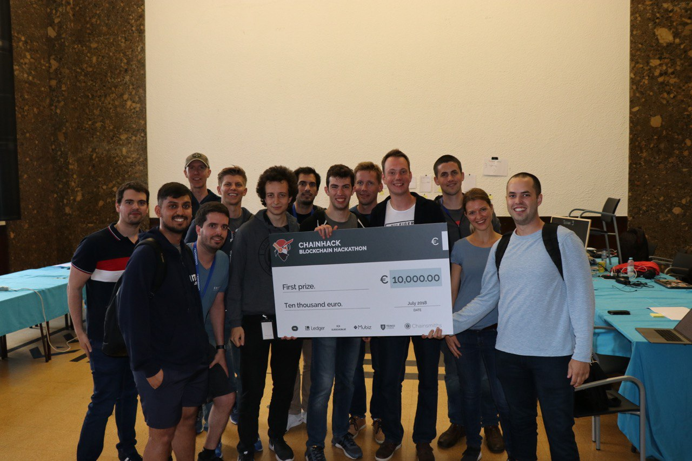

# lnhw

[Chainlab 2018 hackathon](https://blockchain-hackathon.com/) project for a LN hardware wallet.

See the [slides](chainhack-slides.pdf) we presented
for an overview of the concept and our prototype.

## Current status

This is a *early prototype* demonstrating how a LN hardware wallet might be constructed. We hope to continue
developing the project into a toolkit to make it easier for anyone to build their own hardware wallet. We
would not recommend anyone try to build a wallet or run the UI based on the current code, especially
for real funds. Watch this space for updates.

## Related projects

- [Bitcoin Core](https://github.com/bitcoin/bitcoin): the most widely used Bitcoin client that is
  compatible with the consensus rule of the network
- [c-lightning](https://github.com/elementsproject/lightning): the BOLT-compliant lightning network
  implementation by Blockstream. We have a fork at [hkjn/lightning](https://github.com/hkjn/lightning)
  with some patches to make it possible to run a `lightningd` daemon on a laptop, but using a hardware
  wallet for any operation that could spend the user's funds
- [arduino-bitcoin](https://github.com/arduino-bitcoin/arduino-bitcoin): A project started by
  [@stepansnigirev](https://github.com/stepansnigirev) to provide an Arduino library for Bitcoin
  primitives
- [arduino-lightning](https://github.com/arduino-bitcoin/arduino-lightning): Another
  [@stepansnigirev](https://github.com/stepansnigirev) project which provides an Arduino library for
  working with the Lightning Network

## Architecture

Since we had [13 team members](doc/team/readme.md) for the hackathon, we split up into three groups based on
background and interests to attempt to parallelize the work, to focus on three different conceptual
layers of the prototype we built. This worked reasonably well, although in hindsight we should have
taken more shortcuts and tried to integrate the work of the different groups much earlier!

The conceptual layers were:
- `ui` layer: what's shown directly to the user on the laptop, as well as the logic talking to `lightningd`
- `client` layer: patched c-lightning, running on linux desktop (possibly mobile later)
- `hardware` layer: code running on Arduino devices to provide a reasonably secure wallet

The prototype we pitched and demoed used a Linux / MacOS laptop with `bitcoind` and
[our patched `lightningd`](https://github.com/hkjn/lightning) running, as well as a
[Python web backend](rpc/) to communicate with `lightningd`, and to serve requests
from the [React frontend](ui/) code.

### `client` notes

We have a fork of c-lightning at [hkjn/lightning](https://github.com/hkjn/lightning), where we
added patches to allow the private key material to stay on the hardware wallet and not
be exposed to the client device (Linux laptop). At least that was the ideal, which
turned out not to be fully feasible within the roughly two days for the Hackathon..

There's some notes by @stepansnigirev at [doc/hsmd/readme.md](doc/hsmd/readme.md) that outlines
the structure of c-lightning.

### `hardware` notes

We used [Adafruit Feather M0 with SD card slot](https://www.adafruit.com/product/2796) and an [OLED FeatherWing](https://www.adafruit.com/product/2900). SD card can be used for encrypted data storage and OLED extension board has 3 buttons for user interaction.

Currently we are refactoring code of the hardware part, status and architecture description can be found in the [arduino](arduino/) folder. There you can also find a list of [compatible boards](arduino/readme.md#boards). In general it should work on any 32-bit MCU (for example, based on ARM Cortex M0 and further).

Yes, we know that Arduino is not secure at all, and one should never use these boards for real funds, but we also plan to develop a security-oriented Arduino-compatible board such that anyone could use them with any crazy extension boards to make their own lightning- and bitcoin-powered device. Stay tuned!
