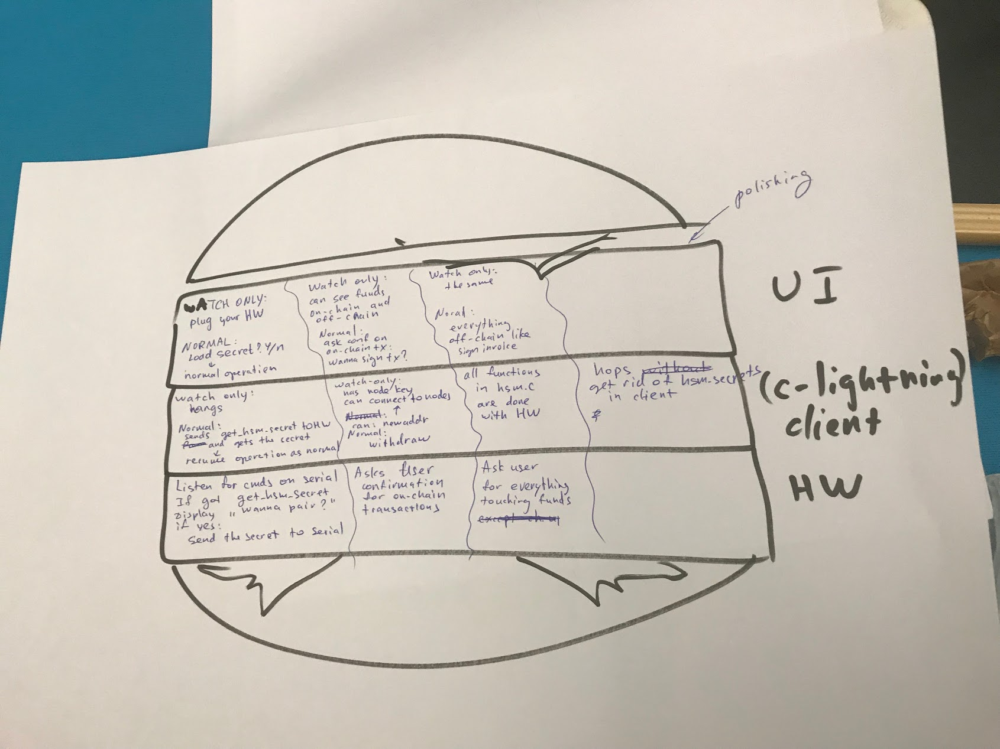

# Goal

Below we sketch out a desirable "dream state" of all the stuff we'd like
to do if we can get to it.

## Layers

To realize the UI flows described below, we can structure the work into several
layers:

- UI layer: what's shown to the user, on both client and hardware device
- client layer: what's running on the laptop
- hardware layer: what's running on the Arduino devices

As the pictures below shows, we're trying the ["hamburger method"](https://gojko.net/2012/01/23/splitting-user-stories-the-hamburger-method/)
of project planning. The TL;DR is that for each flow, we are trying to separate the work into the ui, client and hardware layers, with
each "bite" of the hamburger corresponding to a new set of features, building on the last bite. After each bite has been completed,
we should be integrating the work in the different layers to see if we've actually gotten everything to integrate and work together.

## Flow 1: Viewing wallet

### Goal state

1. GUI starts in "watch-only mode"
  - can view onchain and offchain funds
  - can't route payments in this state
  - GUI shows "plug in your hardware device"
  - GUI is either web UI or native desktop app, showing state from c-lightning
  - when user plugs in hw device, it shows "computer wants to run a lightning node. accept?"
  - bonus: hw device asks for password or PIN before syncing

1b. Onchain wallet deposit and withdraw

### Bite 1

- `ui`
  - client starts in "disconnected" mode, showing "plug in your hardware wallet" message
  - hardware wallet detects when it is plugged in, shows "want to pair?" message and
    yes / no button
- `client`
  - in "disconnected mode", hangs
    1. i.e. for c-lightning, instead of reading `hsm_secret` from disk, we block until the serial device appears
    2. when the device file appears, we try to fetch `hsm_secret` from hardware wallet, which should block here
       until user has agreeed to pairing
  - in "normal mode", sends `get_hsm_secret()` command to hardware wallet to fetch secret, then
    resumes normal lightningd operation
- `hardware`
  - listens for commands on serial port
  - if it receives `get_hsm_secret()` command, displays "want to pair?" message
  - if users selects "yes", sends the secret over serial port 

## Flow 2: Payment

2. We visit some web store that accepts LN in browser, get a LN invoice, paste it in desktop app GUI
  - HW device shows confirmation screen saying that LN node wants to pay X sat to Y pubkey with description Z
  - When user confirms, payment is signed, published, and received by webshop

## Flow 3: Channel management

3. Opening a channel also should need hw device confirmation
  - "You want to open channel X towards node with pubkey Y with balance Z"
4. Closing a channel should also need user interaction
  - Otherwise malicious closure could weaken privacy or steal your coins (need to confirm second)

## Flow 4: Generate invoice

- There should be no need to have user accept here, since they are creating an invoice to pay them money..
- Bonus: Would be cool to have UI option to confirm first generation of invoice, since fraud monitoring by staying online almost all the time is necessary at that point

