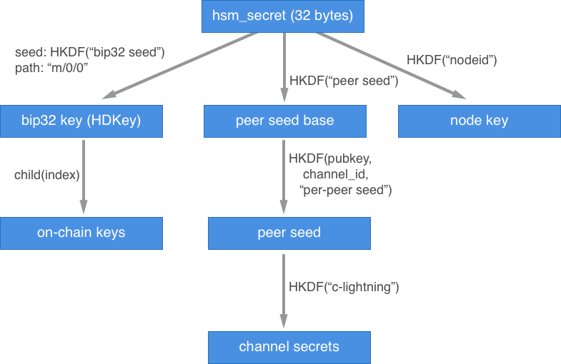

# Internal structure of HSM daemon

# Top-level design

C-lightning uses a multi-process architecture where several processes communicate with each other and encapsulate certain functionality of the program. There is a master daemon `lightningd` that holds all high-level logic and also takes care of communication to other nodes. It spawns several child processes:

- `hsmd` that we are interested in, it handles all the secrets and signs whatever needs to be signed
- `gossipd` - used to find out about other nodes and their channels to find routes for payments
- `onchaind` - manages on-chain funds (normal, non-lightning balance)
- `openingd` - opens channels
- `channeld` - takes care of channel management, channel updates, announcements, hopes and so on
- `closingd` - closes channels

All these daemons can talk to `hsmd` and ask for signatures, public keys and everything else required for their operation. We need to replace original `hsmd` with our custom one that talks to the hardware wallet.

# Key derivation

In c-lightning everything is derived from the same secret - `hsm_secret`. Schematic diagram of the key derivation is shown below:



Here `HKDF` is a [key derivation function](https://en.wikipedia.org/wiki/HKDF) that takes a secret and a few other fields as inputs and generates a random-looking sequence of bytes that can be used as HD private key, encryption key for communication, HTLC and so on.

Three types of keys are used in `c-lightning`: 

- `bip-32 key` is used for all on-chain transactions (funding, withdrawal, ...)
- `node key` defines public key of our node and is used for communication and signing invoices
- `peer seed`s are used to generate all kinds of channel secrets. All channels have the same base secret, but every per-channel secret is also derived from the base by applying HKDF.

We don't care about the `node key` as it doesn't control any funds, but we DO care about `bip-32 key` and `peer seed`. Unfortunately, all channel secrets are derived from `peer seed` during channel opening and stored in the database without asking `hsmd` further. This is a direct leak of the secrets from the `hsmd` and the `c-lightning` team [is aware of it](https://lists.ozlabs.org/pipermail/c-lightning/2018-May/000050.html). So I hope it will be fixed soon and we can help with it.

# `hsmd` daemon

We only touch `hsmd/hsm.c`. We don't want to do anything with other files as they only define interface between daemons.

## `init_hsm()` 

### `maybe_create_new_hsm()`

When `hsmd` daemon starts, it first checks if there is an `hsm_secret` file in `~/.lightning/` folder, and if not - it generates a new random sequence of bytes and saves it into that file. We want to replace it with asking the hardware if it has a secret and generating a new secret if necessary. This action will require user confirmation on the hardware device (*"Do you want to pair the devices?"*). We also should consider replacing a random 32-byte number with a 12-24 word seed that can be backed up by the human. It's just better in sense of UX.

### `load_hsm()`

Then `hsmd` loads content of the `hsm_secret` file (that is just a 32-byte array) into the `secretstuff` structure. In particular, into the `secretstuff.hsm_secret`. Afterwards it derives a `bip32` key from this secret and stores it in `secretstuff.bip32` field.

### `populate_secretstuff()`

Key derivation works as follows:

- it uses `hsm_secret` to create an [HD wallet](https://github.com/bitcoin/bips/blob/master/bip-0032.mediawiki) by first applying [HKDF](https://en.wikipedia.org/wiki/HKDF) algorithm to it. In particular it uses `hsm_secret` as input key material (data), `0` as salt (increments if it fails to create a key) and `"bip32 seed"` string as info field. From this function it gets a new 32-byte secret that it uses as a seed for HD wallet. It derives a child with a path `m/0/0` from this wallet and stores it in `secretstuff.bip32` field.

Now we have everything necessary in the `secretstuff` structure.

### Example

```
secretstuff.hsm_secret: 1e14cd384691a92120f6702742ca0e06951aeee57e91b5e137526c0a6c0867f4
bip32 seed: 5a9bed3df01abd7aa0f260120530aaf1eea3ac2744648975dc23cfb25a71045d
bip32 master key: xprv9s21ZrQH143K4Swn4rdeRhPLPfN1qJtA6yFR5RBTpU2s614zG7ELFMN6YAW4AGH3jZRJUUQBuPt9pJ5D5jzq65PKWCBy6xNarQAcgofD3Xr
secretstuff.bip32: xprv9wYsM6fW2kCzYkSeu3AFZrJ7bk4Ny3w3L5UaLDKLxLizJcacRNGCVwouqJSNNqoi4DGdA6cf3kFEUDvmSdpCyQu8sYg4x44cpVbUFVpSXkc

or in more details:
chain code: 262f1245ae343a30b93da83adb0de95fe2c0e2751ed285ecfce030ebe35ed261
priv_key[33]: 00 e558f771f5b6dcdd5073a876dbf3b8363377de0db33808ecdf54a76571f9db7d
hash160: 5333f23b0664b8405de8eaf95e2c4417f930d544
pubkey: 0242625c2cf7f546b9786efddd7c33cc1ec2e7cc2ba28e3838426e6415fd10ba09
fingerprint: 6896baf1
```

## Node key

Our lightning node has a public key and corresponding private key used for communication between nodes. In particular this key pair is used for data encryption and key negotiation. We don't really care about this one as it is only used for communication and it doesn't control our funds. **We can keep this one on the laptop**.

Here we don't even need an HD wallet, so we just do HKDF but instead of `"bip32 seed"` in the info field we use `"nodeid"` string instead. Result will be our private key, public key is as usual `secret * G`.

Public keys in c-lightning are represented as 64-byte arrays holding `x` and `y` coordinates of the public point in little endian byte order.

Then, if we need to talk to another node, we generate a message, encrypt it with the other node's public key, sign it with our private key and send it. We don't really care how it's done - we can let c-lightning do all this stuff. Signature is a normal `(r,s)` pair in little endian.

### Example

```
secretstuff.hsm_secret: 1e14cd384691a92120f6702742ca0e06951aeee57e91b5e137526c0a6c0867f4
node private key: 2e87aea4a343a892927284ff8abcb15908f0285ffe8c172309a13764d8ca14ee
node public key: 94b66254e97746a8590add3beff096f1b6affd686755663c36c55d26032a36542c9545e36c2ff66e1fdbfaf748a273c036f04113d0d16983140bb99da40edb4c

hash to sign: 17a2807a1ece6c1ec2f2a7c07049f89ec936f32bf31c2f41059f0d6a7e7ebcef
signature: 5d4550f2b1402585d8c923767d95c25b7ed630229e117b4494b595e427fd20b2255234a8f09551f7935fbc805c401707c8fa92b3cb54f4d7224d631b2b33f97b
```
